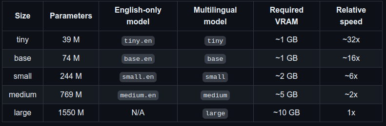

# whisper
 - [OpenAI whisper github](https://github.com/openai/whisper).

## Setup
원문에 따르면 Python 3.8~3.11 버전까지 사용이 가능 하다.<br>
우리의 프로젝트에서는 python 3.10 버전에서 사용하였다.<br>

whisper 설치
```shell
pip install -U openai-whisper
```
<br>
가상환경과는 별개로 시스템에 ffmpeg 이 설치가 되어있어야 한다.

```shell
# on Ubuntu or Debian
sudo apt update && sudo apt install ffmpeg

# on Arch Linux
sudo pacman -S ffmpeg

# on MacOS using Homebrew (https://brew.sh/)
brew install ffmpeg

# on Windows using Chocolatey (https://chocolatey.org/)
choco install ffmpeg

# on Windows using Scoop (https://scoop.sh/)
scoop install ffmpeg
```
<br>
만약 rust 패키지 오류가 발생한다면 rust 를 설치

```shell
pip install setuptools-rust
```


## Model size



우리의 프로젝트에서는 Medium size 의 model 을 사용하였다.

- [다른 AI 모델 보기](/README.md#used-ai-model)
