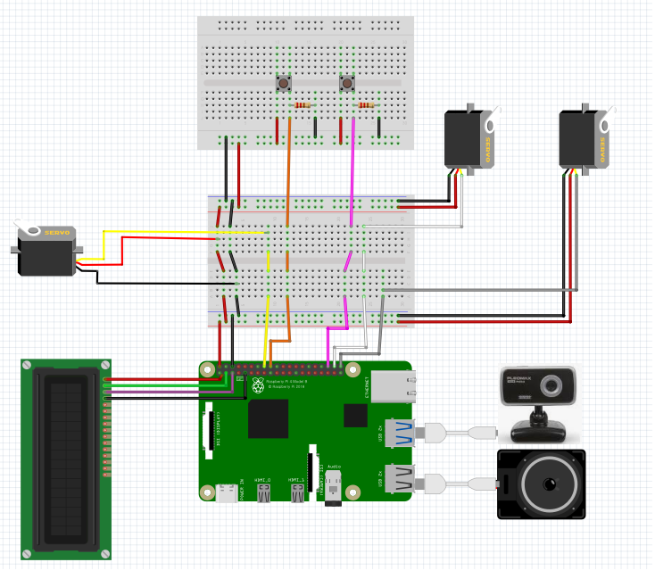

# SeparateTrashCollection CLIENT
<a name="top"></a>

## Prerequisite

* python --verison 3.9.2


### HardWare Setting


윗 사진의 하드웨어 회로도와 같이 회로를 구성한다.


### Activate virtual environment and install packages
```shell
python -m venv .client_venv
source .client_venv/bin/activate
./setup.sh
pip install -U pip
pip install -r requirements.txt
```
라이브러리 사용을 위해 가상환경에 패키지를 설치한다.

### Configure an IP address and GPIO PIN
```shell
EOF_TRASH_CLIENT/resources/communication_config.ini
-> CLIENT 및 LANE_1 IP 환경에 맞게 수정

EOF_TRASH_CLIENT/resources/gpio_config.ini
-> 라즈베리파이 GPIO PIN 실제 연결에 맞게 변경
```
자신의 환경에 맞게 IP와 GPIO PIN 번호를 수정한다.
<br><br>

## Steps to run

```shell
cd EOF_SeparateTrashCollection/EOF_TRASH_CLIENT/
source .client_venv/bin/activate
export QT_QPA_PLATFORM=wayland
python3 main.py
#GUI 최하단에서 /activate lane1 명령어 입력으로 1번 레인 작동
#GUI 최하단에서 /exit 명령어 입력으로 레인 정지
#GUI 최하단에서 /change model 명령어 입력으로 레인에 사용되는 모델 변경
```
동작이 확인이 되었다면 아래와 같이 전원 인가만 하면 원격 실행과 종료가 가능하도록 설정한다.
<br><br>

## Setting User Level Systemd Service for Server Remote Control

```shell
mkdir -p ~/.config/systemd/user/
nano ~/.config/systemd/user/my_service.service
```
my_service.service의 내용은 아래와 같다.
```shell
[Unit]
Description=EOF Trash Client lane 1 Service
After=default.target

[Service]
ExecStart=/usr/bin/python3 /home/eof/EOF_SeparateTrashCollection/EOF_TRASH_CLIENT/listen_launch_cmd.py

[Install]
WantedBy=default.target
```
아래 명령어를 통해 작성한 서비스를 시작 및 등록시켜 부팅 시에 로드하도록 한다.
이로써 사용자는 전원만 인가하면 서버측에서 원격으로 제어를 할 수 있게 된다.

```shell
systemctl --user daemon-reload
systemctl --user start my_service.service
systemctl --user enable my_service.service
systemctl --user status my_service.service
```


<br><br>

## Output

* (프로젝트 실행 화면 캡쳐)


<br><br>

## Appendix

* (참고 자료 및 알아두어야할 사항들 기술) 
* User-Level Systemd Service
* Python Multi-Threading
* TCP / IP 통신
* GPIO HW 제어
