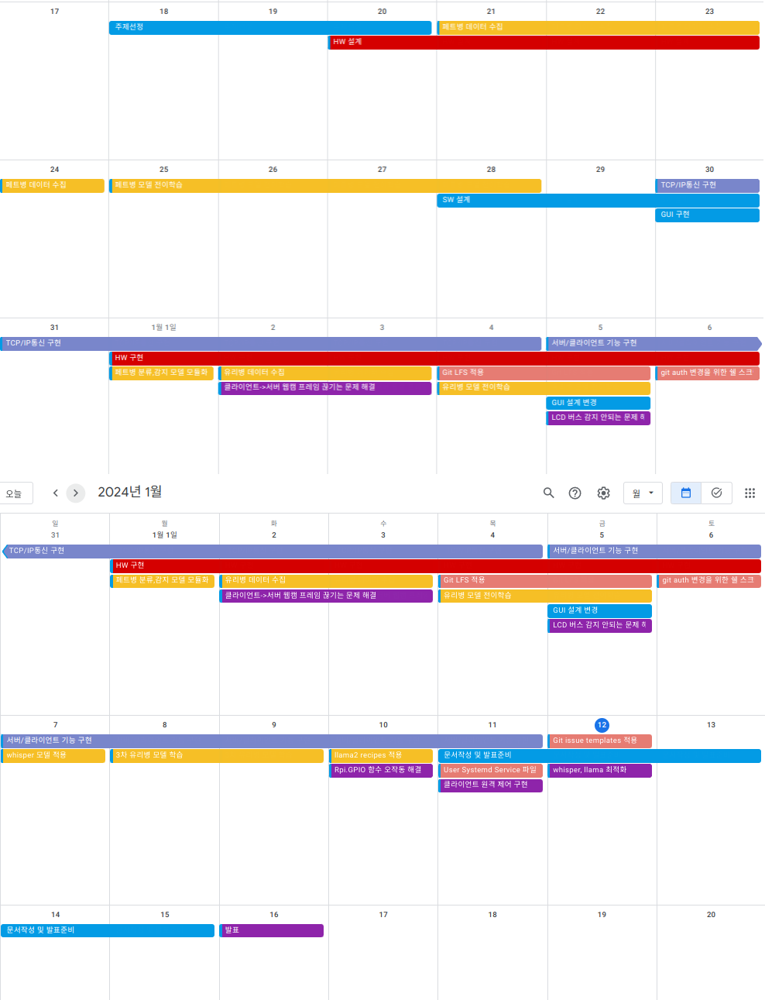
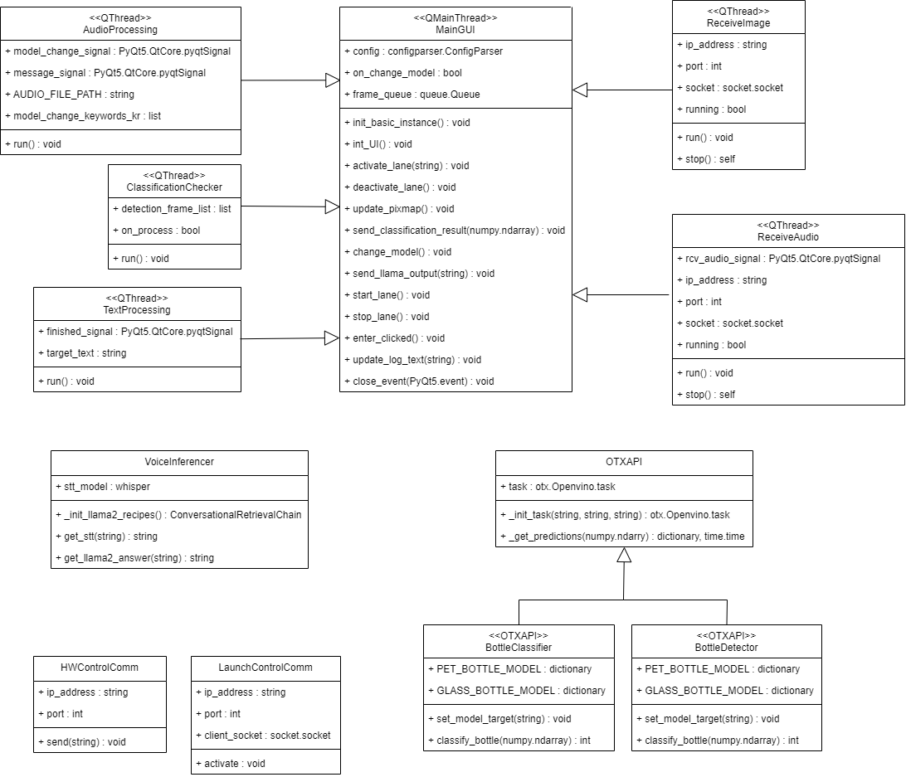
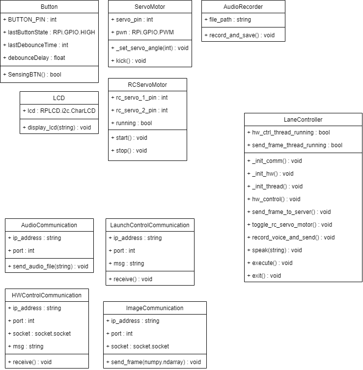

# EOF:EOF - "Edge Of Filtering system"
<a name="top"></a>
<font size="+2">불완전하게 분리수거 된 재활용품에 대한 최종분류 시스템</font>
<br>

## Contents:
 - <font size="+1">[프로젝트 설명](#프로젝트-설명)</font>

 - <font size="+1">[프로젝트 개요](#outline)</font>
 - <font size="+1">[프로젝트 개발 동기](#motivation)</font>
 - <font size="+1">[프로젝트 개발 일정](#project-schedule)</font>
 - <font size="+1">[개발환경 구축](#prerequisite)</font>
 - <font size="+1">[모델 소개](#used-ai-model)</font>
 - <font size="+1">[UML Diagram](#uml-diagram)</font>
 - <font size="+1">[결과물](#output)</font>
 - <font size="+1">[데모 동영상](#demo-video)</font>
 - <font size="+1">[발표 자료](#presentation-document)</font>
 - <font size="+1">[개발 명세서](#development-specification)</font>
<br><br><br>

## Outline
프로젝트 주제: 다양한 AI 를 활용한 프로그램 만들기 <br>
<br>
프로젝트 수행자: 인텔 엣지AI SW개발자 아카데미 3기 / 팀 EOF (권강현, 박도현, 박용근, 우창민)<br>
<br>
프로젝트 수행기간: 23/12/18 ~ 24/01/16<br>

<br>
<br>

* 최상의 재활용 원료를 확보하기 위해 원료 품질을 떨어뜨리는 케이스의 재활용 쓰레기들을 한번 더 분류해주는 시스템

* 쓰레기 분류라인에 있는 작업자가 음성인식을 통해 자유자재로 분류모델을 변경하며, 재활용 쓰레기 분류작업을 진행하도록 하는 것이 최종 목표
<br><br>

## Motivation
<br>

개발 동기는 아래와 같다.
```plain
환경부의 비닐·투명 페트병 분리배출제가 2020년부터 시행되었다.
그러나 현실은 분리배출 시 우리의 귀차니즘 혹은 무지로 인해
분리되었던 라벨이 제거된 투명 페트병과 기타 페트병이
수거과정에서 다시 한데 모여 재분류가 되어야한다는 문제가 있었고,
분리수거 집하장에서 숙련자들의 손에 의해 분류되고 있었다.
우리는 이것을 자동화하려고 한다.
```


유스케이스 시나리오는 아래와 같다.

```
첫번째 재활용 포대A에는 라벨이 남아있는 투명페트병과 라벨이 제거된 투명페트병이 담겨있다.
두번째 재활용 포대B에는 철뚜껑이 남아있는 유리병과 철뚜껑이 제거된 유리병이 담겨있다.


근무자가 포대A(투명 페트병)를 분류 라인에 쏟았다. 
페트병을 분류하는 모델이 적용된 컨베이어벨트 라인이 돌아간다.
현재 컨베이어 벨트 라인은 페트병을 분류하는 모델이 적용 되어있다.
라벨이 남아있는 투명페트병은 컨베이어벨트 진행 도중에 분류되어 쳐내져서 포대C에 담기고, 라벨이 제거되어있는 투명페트병은 컨베이어벨트 끝까지 진행되어 포대D에 담긴다.
첫번째 재활용 포대A(투명 페트병)에 대한 분류가 끝이 났다.


근무자가 포대B(유리병)를 분류 라인에 쏟았다. 
근무자는 마이크 음성인식을 통해 컨베이어벨트에 적용된 분류모델을 변경한다.
현재 컨베이어 벨트 라인은 유리병을 분류하는 모델이 적용 되어있다.
철뚜껑이 남아있는 유리병은 컨베이어벨트 진행 도중에 쳐내져서 포대E에 담기고, 철뚜껑이 제거되어있는 유리병은 컨베이어벨트 끝까지 진행되어 포대F에 담긴다.
두번째 재활용 포대B(유리병)에 대한 분류가 끝이 났다.
```
<br>

## Project Schedule


<br>


## Prerequisite

```shell
git clone https://github.com/yg-park/EOF_SeparateTrashCollection.git
```
<br>

 - <font size="+1">[환경 구축 방법 - 서버](EOF_TRASH_SERVER/README.md#top)</font>
 <br>

 - <font size="+1">[환경 구축 방법 - 클라이언트](EOF_TRASH_CLIENT/README.md#top)</font>
<br><br>


## UML Diagram
 - <font size="+1">[High Level Design](#high-level-design)</font>
 <br>

 - <font size="+1">[Gantt Chart](#gantt-chart)</font>
 - <font size="+1">[Class Diagram](#class-diagram)</font>
 - <font size="+1">[Sequence Diagram](#sequence-diagram)</font>
<br><br><br>
---


### High Level Design

<br>

---

### Gantt Chart



<br>

---
### Class Diagram
서버 클래스 다이어그램


<br>
클라이언트 클래스 다이어그램


<br>
---

### Sequence Diagram
서버측 이미지 수신 후 추론 및 HW 제어


<br>
이미지 추론 FLOW


<br>

<br>
음성 인식 FLOW


<br><br><br><br>


## Used AI Model
** 아래 텍스트를 누르면 상세 설명 README 링크로 연결됩니다.
 - [페트병 - 분류](Documents/Model_README/PetClassification_README.md)

 - [페트병 - 감지](Documents/Model_README/PetDetection_README.md)
 - [유리병 - 분류](Documents/Model_README/GlassClassification_README.md)
 - [유리병 - 감지](Documents/Model_README/GlassDetection_README.md)
 - [whisper - 음성 인식](Documents/Model_README/WHISPER_README.md)
 - [llama2 - 텍스트 생성](Documents/Model_README/LLAMA2_README.md)

<br>

## Output

### GUI

라인 연결 전 화면


라인 연결 후 화면


<br>

<br>


## Demo Video
(아래 이미지를 클릭하시면 유튜브로 이동합니다.)<br>
<!--사진경로, 링크변경 필요-->
[](https://youtu.be/flTNK78fmYE?si=aFhNGE-Y13snIloK)<br>
<br>
<br>


## Presentation Document
(아래 이미지를 클릭하시면 구글 슬라이드로 이동합니다.)<br>
[](https://docs.google.com/presentation/d/1dSDactkOZmvLbq3vEzrDe6EoVVP6ZRbsJCYU4K7vqvE/edit?usp=sharing)<br>
<br>
<br>


## Development Specification
(아래 이미지를 클릭하시면 구글 드라이브로 이동합니다.)
<!--사진경로, 링크변경 필요-->
[](/Documents/EOF_development_specification.pdf)<br>
<br>
<br>

## PR Rules
- Do PR with Title, Description and Details.
- Only the reviewer can approve a PR and perform the merge. The reviewer cannot be assigned.
  ```
  * Title :
  [<Milestone name>] 
  * Description :
  explain what you do.
  * Details :
      1. task1
      2. task2
      3. task3
  ```
<br>

## Issue Rules
 - If you need anything help, or find bug, make new issue and choose assignees, Labels, Milestone


[맨 위로](#top)
